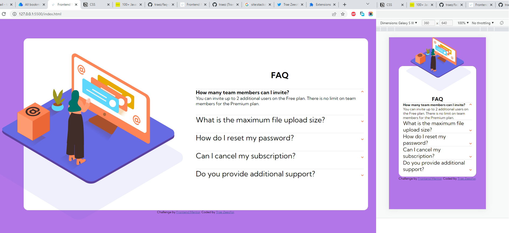

# Frontend Mentor - FAQ accordion card solution

This is a solution to the [FAQ accordion card challenge on Frontend Mentor](https://www.frontendmentor.io/challenges/faq-accordion-card-XlyjD0Oam). Frontend Mentor challenges help you improve your coding skills by building realistic projects. 

## Table of contents

- [Overview](#overview)
  - [The challenge](#the-challenge)
  - [Screenshot](#screenshot)
  - [Links](#links)
- [My process](#my-process)
  - [Built with](#built-with)
  - [What I learned](#what-i-learned)
  - [Continued development](#continued-development)
  - [Useful resources](#useful-resources)
- [Author](#author)
- [Acknowledgments](#acknowledgments)

## Overview

### The challenge

Users should be able to:

- View the optimal layout for the component depending on their device's screen size
- See hover states for all interactive elements on the page
- Hide/Show the answer to a question when the question is clicked

### Screenshot

### Links

- Solution URL: [https://github.com/traez/faq-accordion-card-main](https://github.com/traez/faq-accordion-card-main)
- Live Site URL: [https://traez.github.io/faq-accordion-card-main/](https://traez.github.io/faq-accordion-card-main/)

## My process

### Built with

- Semantic HTML5 markup
- CSS custom properties
- Flexbox
- CSS Grid
- Mobile-first workflow

### What I learned

1) DOM manipulation learning never ends. O ti poju! Learnings plenty...too much to mention.  
2) While still mastering best practice, I reckon documenting (and commenting) solutions is tres important in programming. Be it Algorithms or HTML-CSS-JavaScript code for your clones. You'd need the same sequences for multiple tasks, and being able to review your past work saves you time Googling.  

### Continued development

Keep attempting JavaScript projects till I've very comfortable with my level of proficiency.  

### Useful resources

Stackoverflow, MDN Web Docs, w3schools, YouTube, Google 

## Author

- Website - [Trae Zeeofor](https://github.com/traez)  
- Frontend Mentor - [@traez](https://www.frontendmentor.io/profile/traez)  
- Twitter - [@trae_z](https://twitter.com/trae_z)

## Acknowledgments

Shout out to the Originators; there's not greater.
